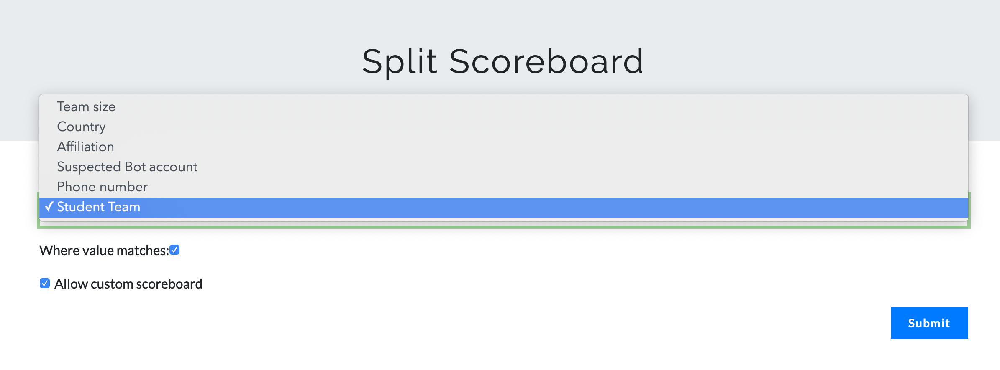
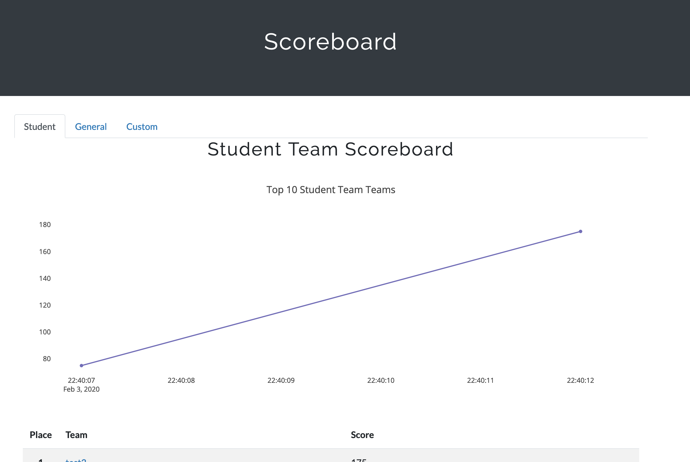
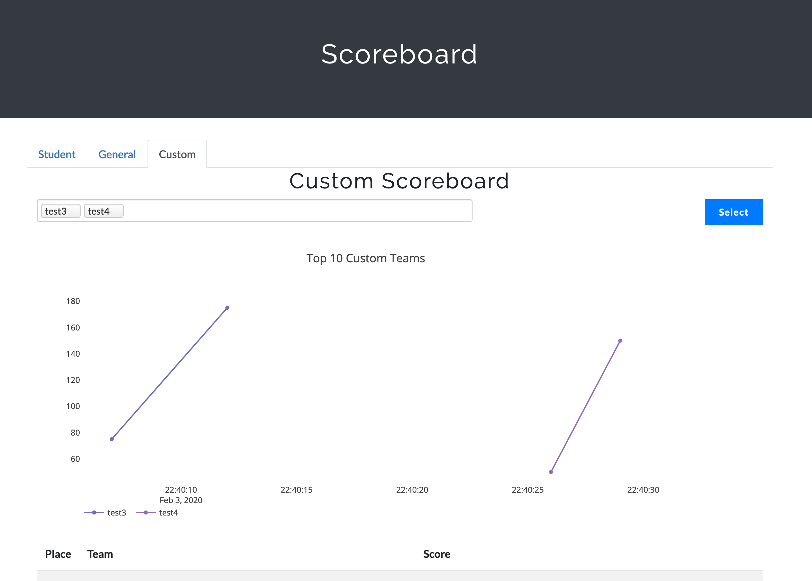

# CTFd Split Scoreboard

Splits the scoreboard by the selected attribute.

Note: This plugin currently only supports running in Teams mode.


## Admin Interface


Admins can pick which attribute of the teams they wish to split the scoreboard on. Attributes can be added using CTFd's built-in Custom Fields.
Admins can decide if they wish to offer the custom scoreboard tab. This tab will allow users to select the teams they want to see ranked against eachother. This is useful for groups who wish to see how they rank against their peers, such as student teams all competing in the same classroom. 




## Scoreboard Interface

The scoreboard page will now show 2-3 tabs, depening on if the custom scoreboard option is enabled.



The first tab will show the scoreboard of the teams who have the matching field.

The second tab will show the scoreboard of the teams who do not have the matching field.

Finally, the optional 3rd tab will show the custom scoreboard, unique for each viewer.
The Custom scoreboard allows a user to select the teams they want to track for their own scoreboard.



## Installation

Installing the plugin is just a matter of cloning this repo into you `CTFd/plugins/` directory 
then start/restart your CTFd instance.

```sh
git clone git@github.com:durkinza/CTFd_Split_Scoreboard.git
```


## Usage

Custom fields are added in CTFd's Admin Panel -> config -> Custom Fields
(Currently only Team fields are supported)

To select which field you wish to split the scoreboard on go to
CTFd's Admin Panel -> plugins -> Split Scoreboard 


## Contributing
Pull requests are welcome! For major changes, please open an issue first to discuss what you would like to change.


## License
[Apache License 2.0](https://choosealicense.com/licenses/apache-2.0/)
